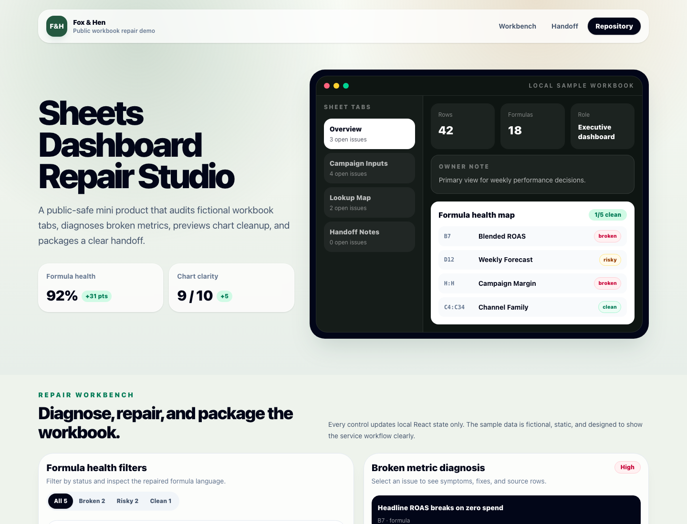

# Sheets Dashboard Repair

A fictional Google Sheets-style repair demo with sample rows, chart status, and handoff notes.

## Service Mapping

- Fox & Hen offer: Google Sheets dashboard repair and handoff
- Upwork catalog proof point: Spreadsheet dashboard cleanup
- Live demo: https://foxhen-sheets-dashboard-repair.vercel.app
- Repository: https://github.com/foxandhenllc/foxhen-sheets-dashboard-repair

## Screenshot



## What This Demonstrates

- A polished React/Vite/TypeScript interface for a small fixed-scope service.
- A clear intake-to-handoff workflow using fictional sample data.
- Public-safe portfolio proof for Fox & Hen, LLC without real customer data, credentials, or production access.

## Local Run

```bash
npm install --package-lock=false
npm run dev
```

## Build

```bash
npm run build
```

## Scope Note

This repository is a public sample app. It uses local static data only and does not require environment variables, accounts, payments, databases, or third-party services.
